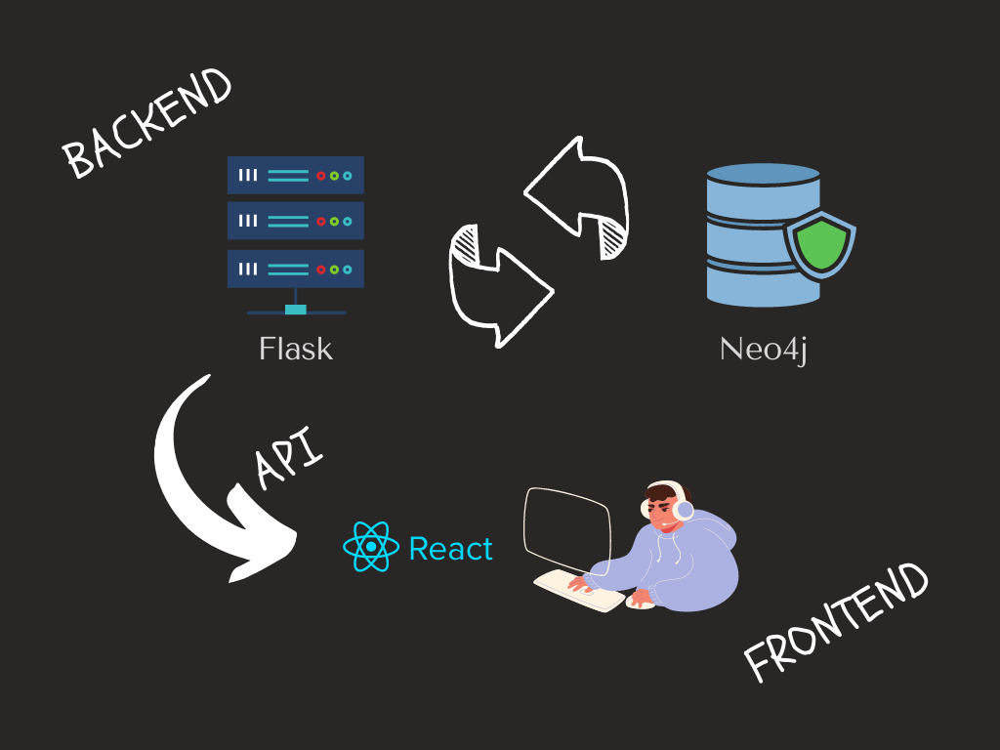

# Recomendation System

Recomendation System is a React, Flask and Neo4j project for dealing with users data and give an apropiate product recomendation.

## Description

This project uses graph database to store User data related to previous boughts, similar Users behavior, locations and categories whete they supply from. It's important take a note this project is for retail market, so we can't recomend products based on interactions if user is already registered

The workflow of this project is this:


## Installation

First clone repo.

```bash
    git clone https://github.com/NoDanCoder/System-Recomendation
    cd System-Recomendation
```
Then import dependences.
Python:
```bash
    cd backend
    pipenv shell
    pipenv
```
react:
```bash
    pipenv exit
    cd ../fronted
    npm i
```
Now run databaseFill.txt into your neo4j database.
Make you sure env variables are settend to login into database, for more info check neomodel documentation.

## Usage

You can get into:
```
    http://localhost:3000/user/:id
    ```

    Ro retrieve data and recomendation sample of given user throughout his id.

    ## Contributing
    Pull requests are welcome. For major changes, please open an issue first to discuss what you would like to change.

    Please make sure to update tests as appropriate.

    ## License
    [MIT](https://choosealicense.com/licenses/mit/)
